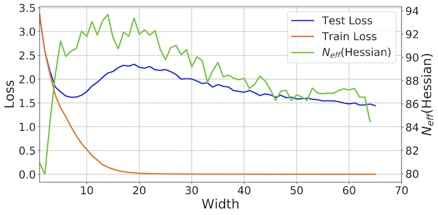

## Rethinking Parameter Counting: Effective Dimensionality Revisted

This repo contains the code needed to replicate the experiments in **Rethinking Parameter Counting: Effective Dimensionality Revisted** by [Wesley Maddox](https://wjmaddox.github.io), [Gregory Benton](https://g-benton.github.io/), and [Andrew Gordon Wilson](https://cims.nyu.edu/~andrewgw/).

Please cite our work if you find it useful:
```
placeholder for bibtex
```

### Introduction

In this paper we examine the effective dimensionality of the Hessian of the loss (shortened to effective dimensionality) as a way to explain generalization performance in neural networks. We revisit an interpretation offered by McKay (1992): the effective dimensionalilty describes the number of parameters determined by the data. Using this interpretation we find that across many architectures of varying sizes the effective dimensionality of the model provides a much better proxy for generalization than simply counting the number of parameters a model contains.

<p align="center">
  
</p>
A resolution of double descent. We replicate the double descent behaviour of deep neural networks using a ResNet18 on CIFAR-100, where train loss decreases to zero with sufficiently wide model while test loss decreases, then increases, and then decreases again. Unlike model width, the effective dimensionality computed from the eigenspectrum of the Hessian of the loss on training data alone follows the test loss in the overparameterized regime, acting as a much better proxy for generalization than naive parameter counting.

<p align="center">
  
</p>
**Left**: Effective dimensionality as a function of model width and depth for a CNN on CIFAR100. **Center**: Test loss as a function of model width and depth. **Right**: Train loss as a function of model width and depth. Yellow level curves represent equal parameter counts (1e5, 2e5, 4e5, 1.6e6). The green curve separates models with near-zero training loss. Effective dimensionality serves as a good proxy for generalization for models with low train loss. We see wide but shallow models overfit, providing low train loss, but high test loss and high effective dimensionality. For models with the same train loss, lower effective dimensionality can be viewed as a better compression of the data at the same fidelity. Thus depth provides a mechanism for compression, which leads to better generalization.

#### Posterior Contraction Experiments; Section 4

To produce the Figure 4 in the paper you will first need to generate the eigenvalues of the Hessian associated with Bayesian neural networks trained using increasing numbers of data points by running `/notebooks/bnn_regression_varying_dimensionality.ipynb`. You will then be able to run `/notebooks/BLR_effective_dimension.ipynb` to compare the effective dimensionality of a Bayesian linear regression with an increasing number of data points.

#### Loss Surface Experiments; Section 5

To see all results from Section 5 of the paper just run `/notebooks/two_spirals.ipynb`. We provide similar results to those of Section 5 for the CIFAR10 dataset. All code needed to generate these results is contained in `experiments/cifar-homogeneity/` and `experiments/cifar-loss-surfaces/`, there are README files in those directories that walk through producing the relevant data and figures.

### Package

To install the package, run `python setup.py develop`. See dependencies in `requirements.txt`. You will need the latest version of PyTorch (>=1.0.0), and standard scipy/numpy builds. Most of the codebase is written to use a GPU if it finds one.


### References
- MacKay, David JC. "Bayesian model comparison and backprop nets." Advances in neural information processing systems. 1992.
